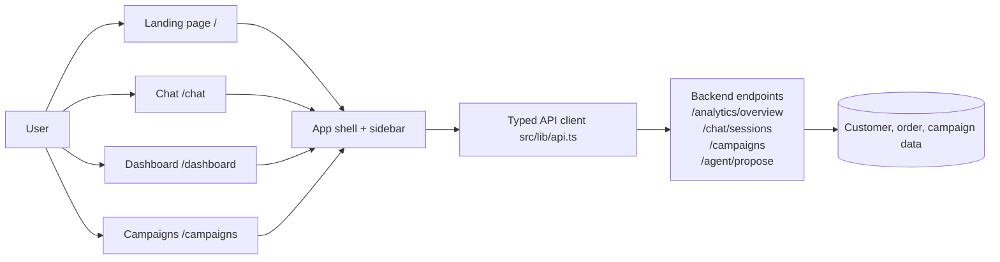
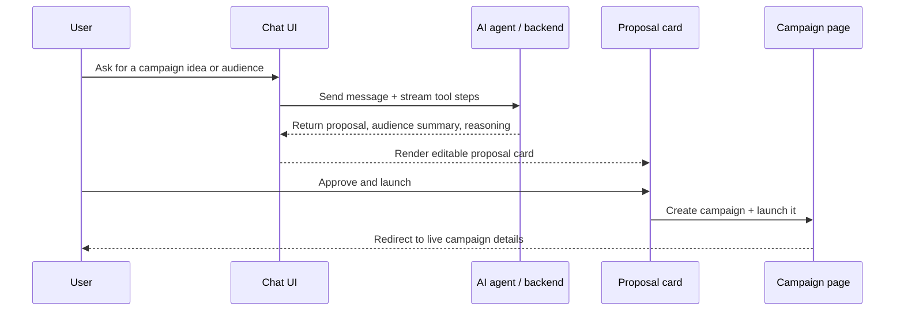
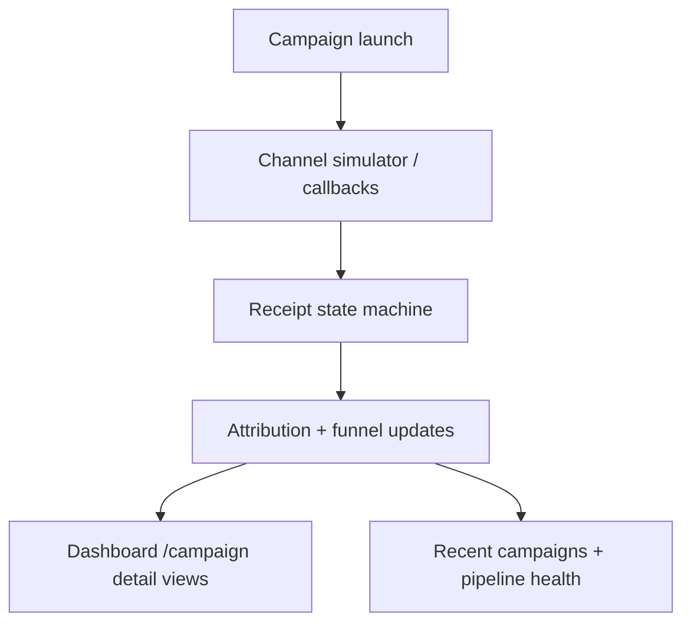

# AudienceOS Frontend

AudienceOS is the React/Next.js frontend for an AI-native mini CRM. It lets a user describe a campaign goal in plain English, receive a proposal from the agent, approve and launch it, and then monitor attribution, delivery health, and campaign performance in real time.

## What this app does

- Launches the public landing page at `/`
- Provides an AI chat workspace at `/chat` and `/c/[id]`
- Shows live performance data on `/dashboard`
- Lists and drills into launched campaigns on `/campaigns` and `/campaigns/[id]`
- Uses a typed API client to talk to the backend at `NEXT_PUBLIC_API_URL`

## High-level architecture



## Campaign proposal flow



## Dashboard and attribution flow



## Key user journeys

1. Start a conversation
   - Open `/chat` and ask for audience discovery, sales summaries, or a proposal.
   - The assistant streams tool steps while it works.

2. Review and approve a proposal
   - The proposal card shows audience size, estimated delivery, recommended channel, and editable message copy.
   - Approval creates a campaign record and launches it.

3. Watch performance live
   - `/dashboard` refreshes every few seconds and displays funnel metrics, channel breakdown, and pipeline health.

4. Inspect campaign history
   - `/campaigns` lists launched work, and `/campaigns/[id]` shows conversion funnel details and attribution metrics.

## Folder structure

```text
src/
  app/
    page.tsx                  # public marketing / landing page
    (app)/
      layout.tsx              # sidebar shell for product pages
      chat/page.tsx           # chat entry
      dashboard/page.tsx      # live dashboard
      campaigns/page.tsx      # campaign index
      campaigns/[id]/page.tsx # campaign detail
  components/
    chat.tsx                  # conversation UI, streaming, trace panel
    artifacts.tsx             # proposal, audience, analytics cards
    sidebar.tsx               # persistent navigation + recents
    markdown.tsx              # markdown rendering
    skeleton.tsx              # loading states
    status.tsx                # status badges
  lib/
    api.ts                    # fetch client and typed backend calls
```

## Local development

### 1. Install dependencies

```bash
npm install
```

### 2. Start the frontend

```bash
npm run dev
```

Then open:

- http://localhost:3000

### 3. Connect to the backend

The frontend expects a backend API available at:

```bash
NEXT_PUBLIC_API_URL=http://localhost:3000
```

If you do not set this value, the app falls back to `http://localhost:3000`.

## Available scripts

```bash
npm run dev      # start Next.js in development mode
npm run build    # production build
npm run start    # start the production build
npm run lint     # run ESLint
```

## Environment notes

- This project uses Next.js 15 and React 19.
- The app relies on a backend that exposes analytics, chat session, campaign, segment, and proposal endpoints.
- The typed API client in `src/lib/api.ts` is intentionally thin so the UI stays decoupled from backend specifics.

## Design notes

- The landing page and the product shell are intentionally separated.
- The sidebar keeps conversation history and navigation visible while the main content area stays focused on the active workflow.
- The chat experience supports streaming tool steps so the user can see the agent working instead of waiting silently.
- The dashboard and campaign detail views are built to tolerate transient backend outages by preserving the latest good data while showing reconnect status.

## Troubleshooting

- If the dashboard or chat pages fail to load, confirm the backend is running and that `NEXT_PUBLIC_API_URL` points to the correct host.
- If the app shows stale analytics, refresh the page or verify the backend is returning the expected JSON shape for `/analytics/overview`.
- If you want a clean restart, remove `.next/` and reinstall dependencies.

## Summary

AudienceOS Frontend is the user-facing layer for a campaign-planning and attribution workflow. It combines a conversational AI interface, structured analytics views, and an approval-to-launch path into one focused product experience.
